> 🇰🇷 [한국어 README 보기](README_KO.md)

# 📝 Supplier OAMI Evaluation App

A web app for auditors to record a supplier's per-process **OAMI** (process-quality) evaluations on-site — Line Type + Type (MH / OP / WIP) + PAMI score (1–5) + description/remark per process — with automatic **local + cloud** dual backup so no work is lost if your device or connection drops.

*(Documentation last verified against app version **2.29.0**. Written and screenshotted from a phone-sized screen, since this app is mainly used on-site on mobile — everything below still works the same way on a PC browser.)*

This guide is written for someone opening the app for the very first time — just follow the steps in order.

---

## 🔗 Open the App

No installation needed — just open it in your browser:

**👉 https://oamigmscore.streamlit.app/**

It works on both PC and mobile browsers, but is designed mobile-first for on-site use.

---

## ✨ Features

| Feature | Description |
|---|---|
| Dual backup | Every change is saved automatically to a local backup, and mirrored to the cloud in the background whenever you're online. |
| Offline-safe | If the connection drops, the app keeps working and saving locally; it re-syncs to the cloud automatically once you're back online — no data is lost either way. |
| Typing-safe drafts | Even before you click "Save New Process," what you're typing is auto-saved as a draft, so if the browser tab resets mid-entry you can pick it back up from "Restore Selected Session" instead of retyping everything. |
| Adjustable text size | A 5-level −/+ zoom control at the top of the app makes all text bigger or smaller; the setting is remembered for the session (via the page URL) so a refresh doesn't reset it. |
| Tap-to-build description | 22 preset buttons, grouped by manufacturing flow (material handling → machining → assembly/welding → paint → finishing → quality → packaging/shipping), each tap appends its text to the Description field and can be combined with free typing. |
| Auto Type suggestion | Selecting a Description preset also fills in the matching Type (MH/OP/WIP) for you — you can still change it manually afterward. |
| Line Type + Program(s) Supported | Each process records whether it's on a Shared Line or a Dedicated Line; picking Dedicated Line lets you note which program(s) the line supports. Your last choice carries over as the default for the next process, so you don't have to re-pick it every time. |
| Edit / insert / delete anytime | Use Prev / Next to browse saved processes, edit any of them and click Update, insert a new one in the middle of the list (not just at the end), or delete one — see the dedicated section below. |
| Bulk upload | Register many processes at once via an Excel template (download, fill in, upload). |
| Resume in progress | Restore a session from its local or cloud backup (whichever is newer) within the retention window, to continue exactly where you left off. |
| Mobile & PC export | Copy a plain-text summary (mobile-friendly) or an HTML table (PC-friendly) for email, or auto-fill an Outlook draft with one click. |
| CSV export | Download the full evaluation as a CSV file at any time. |

---

## 🧭 How to Use

### Step 0 — Adjust Text Size (optional)

At the very top of the app, use the **🔠 Text Size** control (`−` / `A` / `+`) to pick from 5 font sizes. The center "A" shows the current step (e.g. `3/5`) at its actual size, so you can see the effect immediately. Your choice stays applied for the rest of the session.

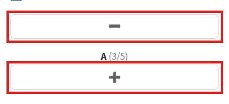

### Step 1 — Supplier & Evaluator Info

If a backup from the past 14 days exists (locally or in the cloud, whichever is newer), a **"Restore Selected Session"** dropdown appears so you can pick it up where you left off — including anything you were mid-typing when the session was interrupted.

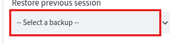

Otherwise, enter **Supplier Name** and **Evaluator Name** (both required), then tap **Go Evaluation** to start. If either field is empty, you'll see: *"🚨 Please enter both Supplier Name and Evaluator Name."*

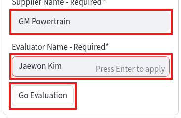

Once evaluation starts, a status caption tells you whether the cloud connection is active:
- **☁️ Cloud sync: connected** — your data is backed up locally and to the cloud.
- **📴 No internet connection** — your data is still being saved locally, and will sync to the cloud automatically once you're back online.

### Step 2 — (Optional) Bulk Upload via Excel

Open **📂 Bulk Upload via Excel** to register several processes at once: download the template, fill it in on a PC, then come back and upload it.

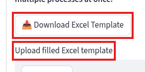

1. Tap **📥 Download Excel Template** — it includes sample rows with the columns `Process Name / Description / Type / Score / Remark`.
2. Fill it in and upload it with **Upload filled Excel template**.
3. Tap **🚀 Upload & Apply Data**. `Description`, `Type`, and `Score` are required columns (`Type` must be `MH`, `OP`, or `WIP`); rows with an invalid Type or Score are skipped with a warning, and the rest are still applied.

   > Note: bulk-uploaded rows don't include Line Type / Program(s) Supported yet — add those afterward for any row that needs them, the same way as a manually entered process (see Step 3 below).

### Step 3 — Enter Each Process

First, tap any of the 22 **Description Preset** buttons above the input box to append that step's name to Description (you can tap several in a row — e.g. tap *Unloading* then *Moving* to get `"Unloading, Moving"`). Tapping a preset also sets **Type** to match that preset's usual category; the *last* preset you tap wins, and you can still change Type manually afterward.

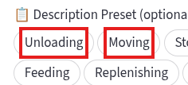

Then fill in the rest of the box:

1. **Process Name** (optional) — a free-text label for the process/station.
2. **Line Type** (required) — choose **Shared Line** or **Dedicated Line**.

   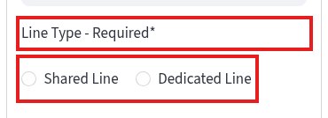

   If you choose **Dedicated Line**, a **Program(s) Supported** field appears so you can note which program(s) the line is dedicated to (optional).

   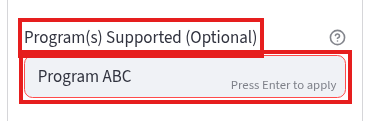

   Whatever you pick here (Shared/Dedicated, and the program(s) you typed) is remembered as the default for your *next* new process, so you don't have to re-select it every time — you can still change it whenever it's actually different.
3. **Description** (required) — type directly or edit around what the presets inserted, or clear it entirely with the small trash-can button next to the field (this only clears Description — the other fields are untouched).

   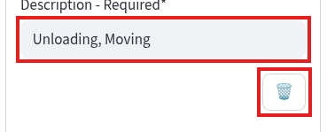

4. **Type** (required) / **Score 1–5** (required) — Type is pre-filled by the last preset tapped, but freely changeable.

   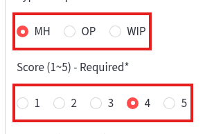

5. **Remark** (optional) — any additional note.
6. Tap **Save New Process** (or **Update Process** if you're editing an existing entry).

   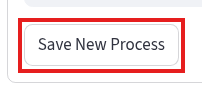

### Step 3.5 — Editing, Inserting in the Middle, and Deleting a Process

Once you have processes saved, three buttons appear below the input box: **⬅️ Prev**, **Next ➡️**, and **➕ New**. A status line under them tells you what you're currently looking at — either **"✏️ Editing No. X / Y : ..."** for a saved process, or **"✨ Add New Process as No. X"** while preparing a new one.

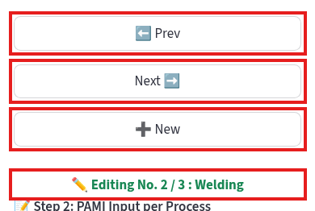

**To edit a saved process:** tap **Prev** / **Next** to browse to it (this cycles through all saved processes — Prev from the first wraps to the last, and vice versa), change whatever fields need updating, then tap **Update Process**.

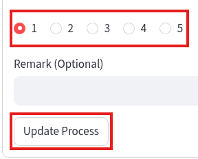

**To insert a new process in the middle of the list** (not just add one at the end): use Prev/Next to browse to the process you want the new one to come *right after*, then tap **➕ New**. The status line will confirm the new one's position, e.g. "Add New Process as No. 3" — fill in the fields and tap **Save New Process** as usual, and it's inserted at that exact spot (everything after it shifts down by one).

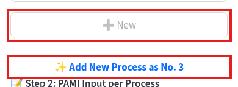

**To delete a saved process:** browse to it with Prev/Next, then tap **🗑️ Delete**.

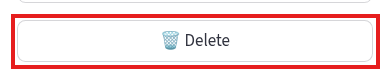

A confirmation prompt appears — tap **✔️ Yes, Delete** to remove it for good, or **❌ Cancel** to back out.

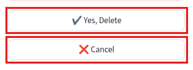

Use **🚫 Cancel** (shown next to Delete when you're not in the delete-confirmation step) to discard an in-progress new entry without saving it.

### Step 4 — Evaluation Summary & Export

Once you have at least one process saved, a **📊 Evaluation Summary** section appears below the input box, showing **Total Processes** and **Total OAMI Average** (out of 5.0).

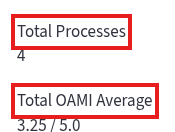

Below that are two tabs: **📱 1. Mobile (Text)** — a plain-text summary you can copy with **📋 Copy Text for Outlook** (note it's one long line per process, so you may need to scroll sideways to read it all on a small screen) — and **🖥️ 2. PC (Table)**, a formatted HTML table better suited to pasting into an email from a computer. In both, **Line Type** and **Program(s) Supported** are combined into a single **Program(s) Supported** column — it shows **"Shared"** for a Shared Line, or the program name(s) you entered for a Dedicated Line — so the data pastes cleanly into a single Excel column.

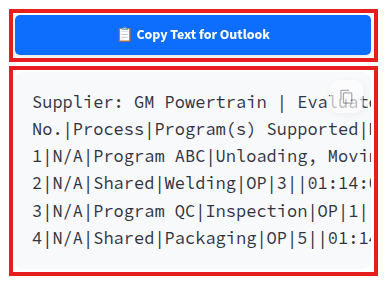

Further down: **📨 Open Outlook Mail App** opens a new mail draft with the mobile text summary pre-filled in the body; **📥 Download CSV Backup** downloads the full record as a CSV file (a checkbox, checked by default, also deletes the temporary system backup after downloading — **the CSV file is the only permanent copy**, system backups are temporary); and **🚨 Clear All Data (Start New)** resets the app for a fresh evaluation after a confirmation step.

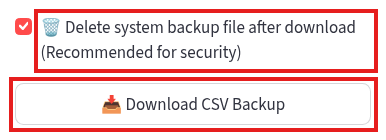

---

## 💾 Backup & Data Policy

| | Local backup | Google Sheets backup | CSV download |
|---|---|---|---|
| When it's saved | Automatically, after every change (including drafts while typing) | Automatically, whenever online (best-effort) | Manually, on demand |
| Persistence | Temporary — kept for the retention window, can be cleared | Temporary — kept for the retention window, can be cleared | **Permanent** — this is the only copy you should rely on long-term |
| Requires internet | No | Yes | No |

Restoring a past session (Step 1) always uses whichever of the local or cloud backup is more recently updated, so you never lose progress no matter which one was last online.

---

## 🏷️ Type Definitions

| Type | Meaning |
|---|---|
| `MH` | Material Handling — moving, storing, or handling material (e.g. Unloading, Moving, Storaging, Feeding, Loading) |
| `OP` | Operation/Process — a value-adding manufacturing step (e.g. Molding, Stamping, Welding, Painting, Inspection, Packaging) |
| `WIP` | Work In Process — intermediate handling of parts mid-process (e.g. Remove, Conveyor) |

## 🏭 Line Type Definitions

| Line Type | Meaning |
|---|---|
| Shared Line | The line is shared across multiple programs/products — no specific program to note. |
| Dedicated Line | The line is dedicated to one or more specific programs — use **Program(s) Supported** to note which one(s). |

---

## ❓ FAQ

**Q: What happens if I lose internet connection while entering data?**
A: Nothing is lost. The app keeps saving to the local backup as usual and shows a "📴 No internet connection" notice; once you're back online, it resumes syncing to Google Sheets automatically.

**Q: What if I stop typing for a while and the page seems to reset?**
A: Anything you'd typed for the process you were adding is auto-saved as a local draft as you go (even before you click Save). Open **Step 1 → Restore Selected Session** and pick the most recent backup to pick up right where you left off.

**Q: Can I go back and add a process I forgot, between two I already saved?**
A: Yes — see **Step 3.5** above. Browse to the process right before where the new one should go, tap **➕ New**, fill it in, and save; it's inserted at that spot instead of at the end.

**Q: Do I need Google Sheets configured to use the app?**
A: No. Cloud backup is optional — without it configured, the app runs fully on local backups only.

**Q: I downloaded the CSV — is the system backup gone now?**
A: Only if you left the **"Delete system backup file after download"** checkbox checked (it's checked by default). Either way, the CSV file you downloaded is the permanent record going forward.

**Q: Why does the export only show one "Program(s) Supported" column instead of separate Line Type and Program(s) Supported columns?**
A: It's meant to paste cleanly into a single Excel column — Shared Line shows as **"Shared"**, and Dedicated Line shows the program name(s) you entered. The Step 3 input screen still asks for Line Type and Program(s) Supported separately; only the exported summary combines them.

---

## 🔒 Security Notes

- The site never shows any credentials or configuration details in the UI — you only ever see your own evaluation data.
- Backups (local + cloud) are temporary working copies for resuming a session, not a permanent archive — see the table above. Download the CSV whenever you want a permanent, personal copy of your results.
- The CSV file is generated on the spot when you click download and isn't stored anywhere else by the app — it only exists in your own download.

---

## 📄 License

MIT License.